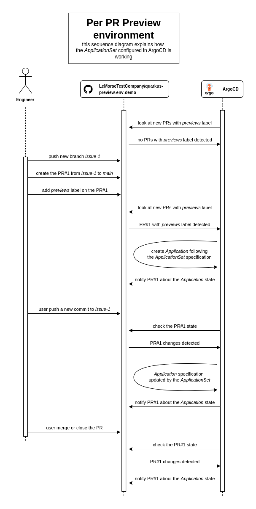

# preview environment with argocd

## Prerequisites

- kind
- kubectl
- docker
- kubectx/kubens

## :warning: ArgoCD set up (deprecated)

:warning: PLEASE FOLLOW THE NEXT SECTION TO INSTALL [ARGOCD USING HELM](#argocd-set-up-using-helm) :warning:

https://github.com/argoproj/argo-cd/releases/tag/v2.10.3

```bash
kind create cluster --name preview-env-cluster
kubectx kind-preview-env-cluster

kubectl create namespace argocd
kubens argocd
kubectl apply -n argocd -f https://raw.githubusercontent.com/argoproj/argo-cd/v2.10.3/manifests/install.yaml
```

The default ArgoCD admin username is `admin` and you can find the password using:
```bash
kubectl -n argocd get secret argocd-initial-admin-secret -o jsonpath="{.data.password}" | base64 -d
```

You can use the kubernetes port-forward feature to access ArgoCD:
```bash
kubectl -n argocd port-forward service/argocd-server 8080:80
```

## ArgoCD set up using Helm

https://argo-cd.readthedocs.io/en/latest/operator-manual/installation/
https://github.com/argoproj/argo-helm/tree/main/charts/argo-cd

```bash
kind create cluster --name preview-env-cluster
kubectx kind-preview-env-cluster

helm repo add argo https://argoproj.github.io/argo-helm
helm repo update argo
helm search repo argo-cd

helm install argocd argo/argo-cd \
  --values argocd/argocd.values.yaml \
  --namespace=argocd --create-namespace
```

The default ArgoCD admin username is `admin` and you can find the password using:
```bash
kubectl -n argocd get secret argocd-initial-admin-secret -o jsonpath="{.data.password}" | base64 -d
```

You can use the kubernetes port-forward feature to access ArgoCD:
```bash
kubectl -n argocd port-forward service/argocd-server 8080:80
```

## Configure the preview environment for our demo application

Our demo application have Helm manifests defined in [preview/templates](/preview/templates) directory.

The github repository is public, so we don't need to manage any secrets.

### Per-PR preview environments

We can configure the _ApplicationSet_ to create a preview environment for each branch:

```bash
kubectl apply -n argocd -f argocd/applicationset.yml
```

The sequence diagram below explains the workflow of the _ApplicationSet_:



### Static preview environment

We can configure the _Application_ to create a preview environment for the main branch:

```bash
kubectl apply -n argocd -f argocd/application.yml
```


## ArgoCD notifications

:warning: The ArgoCD Notifications repository has been merged into ArgoCD repository. The documentation has been moved! :warning:

- :no_entry: the "old" ArgoCD Notifications documentation: https://argocd-notifications.readthedocs.io/en/stable/
- :white_check_mark: the "new" ArgoCD Notifications documentation: https://argo-cd.readthedocs.io/en/latest/operator-manual/notifications/

We'll use ArgoCD Notifications to create a GitHub notification for each preview environment. This will allow the developers to see the status of the preview environment directly in the PR.

We don't need to install the ArgoCD Notifications because it's now embedded in ArgoCD directly.
You can check it using the ArgoCD CLI:

```bash
kubectl exec -it $(kubectl get pod -o custom-columns=:metadata.name | grep argocd-server) -- argocd admin notifications --help
```

### ConfigMap configuration

I'm using the Helm chart to configure the `argocd-notifications-cm` ConfigMap resource.
Once the Helm application is installed, you can check the configuration using:
```bash
kubectl get configmap argocd-notifications-cm -o=yaml
```

I've used the _triggers_ and _templates_ from the catalog manifest (https://raw.githubusercontent.com/argoproj/argo-cd/stable/notifications_catalog/install.yaml).

Check they're available using:
```bash
# see all the triggers configured in the ArgoCD instance
kubectl exec -it $(kubectl get pod -o custom-columns=:metadata.name | grep argocd-server) -- argocd admin notifications trigger get

# see all the templates configured in the ArgoCD instance
kubectl exec -it $(kubectl get pod -o custom-columns=:metadata.name | grep argocd-server) -- argocd admin notifications template get
```

[//]: # (Improve the templates to add the application URLs.)

### Secret configuration

I've disabled the automated creation of the `argocd-notifications-secret` Secret resource.
You'll need to create it by yourself using:
```bash
kubectl create secret generic argocd-notifications-secret --from-literal=github-token=YOUR_GITHUB_TOKEN
```

### Services

#### Github PR notifications

##### Using default subscriptions

:warning: I switched from [default subscriptions](https://argo-cd.readthedocs.io/en/stable/user-guide/subscriptions/#default-subscriptions) to [specific subscription](https://argo-cd.readthedocs.io/en/stable/user-guide/subscriptions/#default-subscriptions). The next section deprecated. :warning:

I've configured a service called `github-comment-on-pr` which allow to send notifications to the Github PRs.
To enable it, you need to add the labels below in your _ApplicationSet_ application template specification:
```yaml
labels:
    custom.argoproj.io/number: '{{number}}'
    custom.argoproj.io/notifiers.github-comment-on-pr: "true"
```

##### Specific subscriptions

You can subscribe to ArgoCD events (the triggers is specified in the [argocd values file](argocd/argocd.values.yaml): `.notifications.triggers`) adding annotations to the _Application_ specification (in both _Application_ or _ApplicationSet_).

The example below will make the application subscribe the service `github-comment-on-pr` to the `on-sync-failed`, `on-sync-status-unknown` and `on-sync-succeeded` triggers.

```yaml
annotations:
    notifications.argoproj.io/subscribe.on-sync-failed.github-comment-on-pr: ""
    notifications.argoproj.io/subscribe.on-sync-status-unknown.github-comment-on-pr: ""
    notifications.argoproj.io/subscribe.on-sync-succeeded.github-comment-on-pr: ""
```

Documentation to the Github create an issue comment documentation: https://docs.github.com/en/rest/issues/comments?apiVersion=2022-11-28#create-an-issue-comment

:memo: Note that in this POC, I've configured the applications created from the [`quarkus-prs` applicationset](argocd/applicationset.yml) to use this service.

#### Dummy WH

This is a POC, so I've also created a "dummy webhook" that will send a POST request to https://argocdtest.requestcatcher.com.
To enable it, you need to add the label below in your _Application_ or _ApplicationSet_ application template specification.
```yaml
labels:
    custom.argoproj.io/notifiers.dummy-wh: "true"
```

:memo: Note that in this POC, I've configured the application created using the [`quarkus-main` application](argocd/application.yml) to use this service.

### Test and troubleshoot

https://argo-cd.readthedocs.io/en/stable/operator-manual/notifications/troubleshooting/

#### Send templates

For testing purposes, you can notify a template to a service using the `--recipient` parameter. 
```bash
kubectl exec -it $(kubectl get pod -o custom-columns=:metadata.name | grep argocd-server) -- argocd admin notifications template notify app-deployed quarkus-demo-app-hello-blue-11 --recipient github-comment-on-pr
```

#### Test template

I've also created a test template that I used to debug the templates.
You can run it using:

```bash
kubectl exec -it $(kubectl get pod -o custom-columns=:metadata.name | grep argocd-server) -- argocd admin notifications template notify test YOUR_APPLICATION
```

#### Redeploy the application manifests

To trigger the different events, you can also reinstall the application manifests using:

```bash
kubectl delete -f argocd/apps/application.yml
kubectl apply -f argocd/apps/application.yml
kubectl delete -f argocd/apps/applicationset.yml
kubectl apply -f argocd/apps/applicationset.yml
```